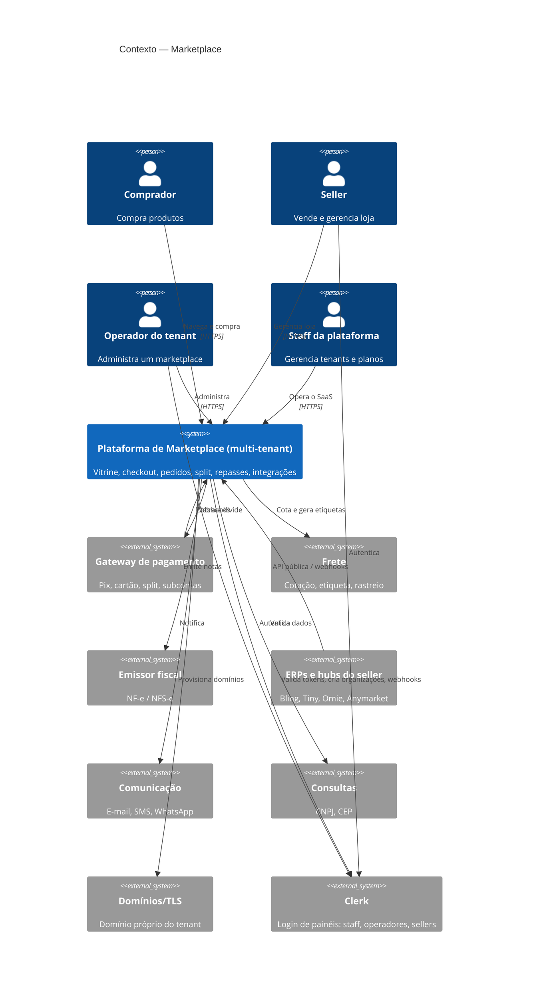
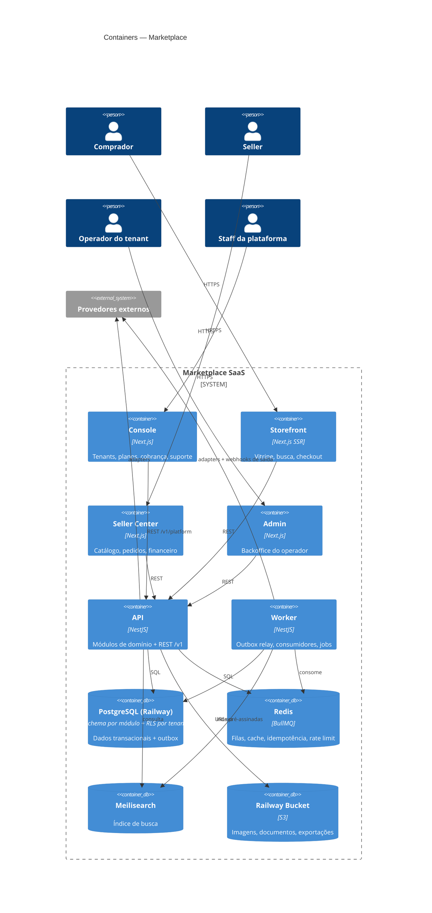
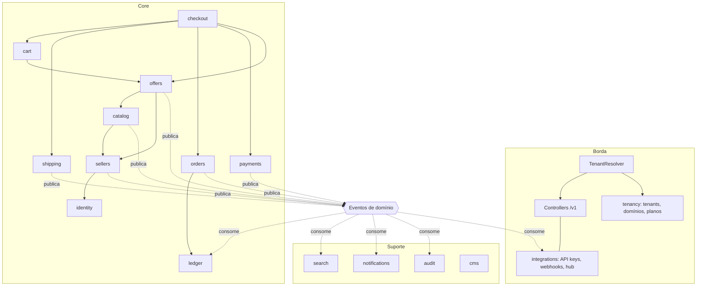

# Arquitetura — 01. Visão Geral

## Visão geral

O marketplace é um **monólito modular** (ADR-001) escrito em TypeScript: um único repositório e uma única
base de código de backend, dividida em **módulos com fronteiras rígidas** (bounded contexts), cada um com
o próprio schema no PostgreSQL e uma API pública interna (facade). Os módulos conversam de forma
**síncrona** por facades quando precisam de resposta imediata e **assíncrona** por eventos de domínio
(outbox + fila) para efeitos colaterais. Todo contato com o mundo externo passa por **ports** implementadas
por **adapters** plugáveis (ADR-005) — é isso que torna o sistema "pronto para qualquer integração".

O sistema é **SaaS multi-tenant em modelo pool** (ADR-012): todos os tenants compartilham código, processos e
banco, isolados por `TenantContext` resolvido na borda, repositórios tenant-aware e Row-Level Security no
PostgreSQL. Detalhes em `06-multi-tenancy.md`.

A mesma base gera dois processos: **api** (HTTP) e **worker** (filas, outbox relay, jobs agendados),
escaláveis horizontalmente de forma independente. Quatro frontends Next.js (storefront, seller center, admin do tenant e console da plataforma) consomem só a API e resolvem o tenant pelo host.

## Atributos de qualidade priorizados

0. **Isolamento entre tenants (segurança)** — vazamento entre marketplaces clientes inviabiliza o negócio.
   Motiva RLS + contexto na borda + suíte de isolamento no CI (ADR-012).
1. **Integrabilidade / extensibilidade** — é o requisito central do negócio. Motiva ports & adapters,
   eventos publicados como contrato, webhooks e API pública versionada.
2. **Consistência financeira** — dinheiro de terceiros circula pela plataforma. Motiva ledger de partidas
   dobradas, máquinas de estado explícitas, idempotência em toda a cadeia e outbox.
3. **Manutenibilidade / time-to-market** — time pequeno com desenvolvimento assistido por IA. Motiva
   monólito (um deploy, um banco, depuração simples), fronteiras verificadas por lint e convenções rígidas
   que o Claude Code consegue seguir.
4. **Escalabilidade para picos** — api/worker stateless, cache, busca fora do banco transacional, filas
   absorvendo picos.

Secundários por ora: latência extrema (não somos HFT; p95 de centenas de ms basta) e independência de
deploy por time (há um só time — o custo operacional de microsserviços não se paga).

## C4 — Contexto

## C4 — Containers

## Visão de módulos (dependências permitidas)

Setas sólidas = chamada síncrona à facade (só nessa direção; ciclos são proibidos).
Setas pontilhadas = eventos. Módulos de suporte **só consomem eventos**, nunca são chamados pelo core
(exceto `search` pela camada HTTP de leitura). O `checkout` é o orquestrador do fluxo de compra.

## Decisões-chave (ADRs)

| ADR | Decisão |
|---|---|
| [ADR-001](../adr/ADR-001-monolito-modular.md) | Monólito modular, não microsserviços |
| [ADR-002](../adr/ADR-002-stack.md) | TypeScript: NestJS + Next.js + Drizzle + PostgreSQL + Redis/BullMQ |
| [ADR-003](../adr/ADR-003-dados-por-modulo.md) | Um schema Postgres por módulo, sem JOIN entre schemas |
| [ADR-004](../adr/ADR-004-eventos-outbox.md) | Eventos de domínio com Transactional Outbox; BullMQ como transporte inicial |
| [ADR-005](../adr/ADR-005-ports-adapters-hub.md) | Ports & adapters + Integration Hub para toda integração externa |
| [ADR-006](../adr/ADR-006-pagamentos-split-ledger.md) | Split no gateway (subcontas) + ledger interno de partidas dobradas |
| [ADR-007](../adr/ADR-007-catalogo-produto-oferta.md) | Catálogo Produto × Oferta |
| [ADR-008](../adr/ADR-008-busca.md) | Meilisearch atrás de SearchPort, alimentado por eventos |
| [ADR-009](../adr/ADR-009-identidade.md) | Identidade própria — hoje só para compradores (ver ADR-013) |
| [ADR-010](../adr/ADR-010-api-publica-webhooks.md) | REST /v1 + OpenAPI, webhooks HMAC, CloudEvents |
| [ADR-011](../adr/ADR-011-infra-observabilidade.md) | (substituído pelo ADR-014) princípios de observabilidade e células |
| [ADR-012](../adr/ADR-012-multi-tenancy.md) | Multi-tenancy pool: `tenant_id` + RLS + TenantContext; células para enterprise |
| [ADR-014](../adr/ADR-014-railway.md) | Railway: Postgres (PITR), Redis, Bucket, Meilisearch e apps; domínios de tenants via Cloudflare for SaaS |
| [ADR-013](../adr/ADR-013-autenticacao-clerk.md) | Clerk para painéis (Organizations = tenants/sellers); identidade própria para compradores |

## Riscos e trade-offs assumidos

| Risco / trade-off | Mitigação / gatilho |
|---|---|
| Monólito = um deploy; bug em um módulo derruba tudo | Testes + deploy canário; processos api e worker separados; extrair módulo quando houver necessidade real de escala/time (RNF-ESC-03) |
| Um único Postgres é ponto central | Instância gerenciada com HA e PITR; réplica de leitura para busca de fallback/relatórios |
| BullMQ/Redis como event bus não oferece replay de longo prazo | Outbox guarda histórico por 30 dias (replay possível); migrar para broker (RabbitMQ/Kafka/SQS+SNS) via port `EventBus` quando houver consumidores externos ou > 1 M eventos/dia |
| Consistência eventual entre módulos (ex.: busca mostra estoque desatualizado por segundos) | Revalidação de preço/estoque no carrinho e no checkout (RN-CHK-01) |
| Dependência do gateway para split | Port único + ledger próprio como fonte de verdade → trocar de gateway é trabalho de adapter + migração de recebedores |
| Dependência da Clerk (disponibilidade, preço, cenário Platforms não suportado) | Port `WorkforceIdentityPort`; storefront/checkout independentes da Clerk; reavaliar com o lançamento do "Clerk for Platforms" |
| Identidade própria de compradores exige cuidado de segurança | Bibliotecas maduras (argon2, jose), testes de segurança; escopo reduzido (só compradores) |
| Vazamento entre tenants por query sem filtro | Três camadas (contexto, repositório, RLS forçado) + suíte de isolamento e teste de cobertura de RLS no CI |
| Vizinho barulhento (Black Friday de todos os tenants ao mesmo tempo) | Cotas e rate limit por tenant, fairness de filas, autoscaling; célula dedicada para tenants grandes |
| Restaurar backup de um único tenant | Export/import lógico por tenant (US do épico E00S) em vez de restore físico |
| Claude Code violar fronteiras "para facilitar" | Regras de lint obrigatórias no CI e `/revisar-arquitetura` ao fim de cada fase |

**⚠️ Suposições:** ver `../01-visao-produto.md` §7 (escala, time, multi-tenancy).
