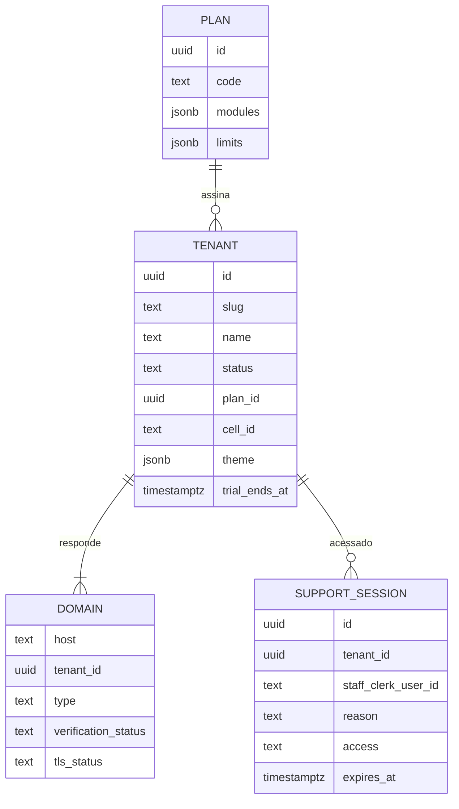
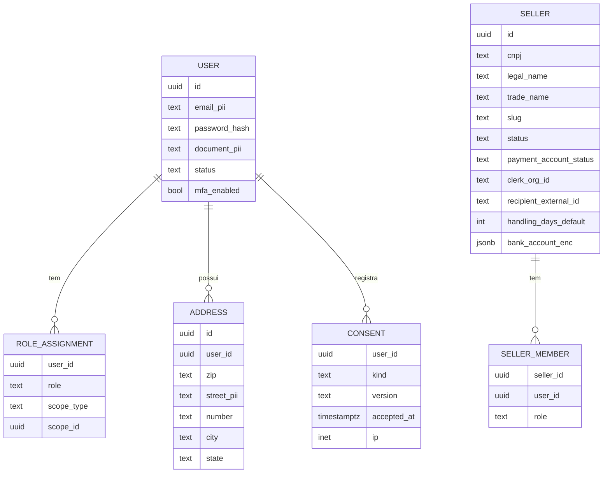
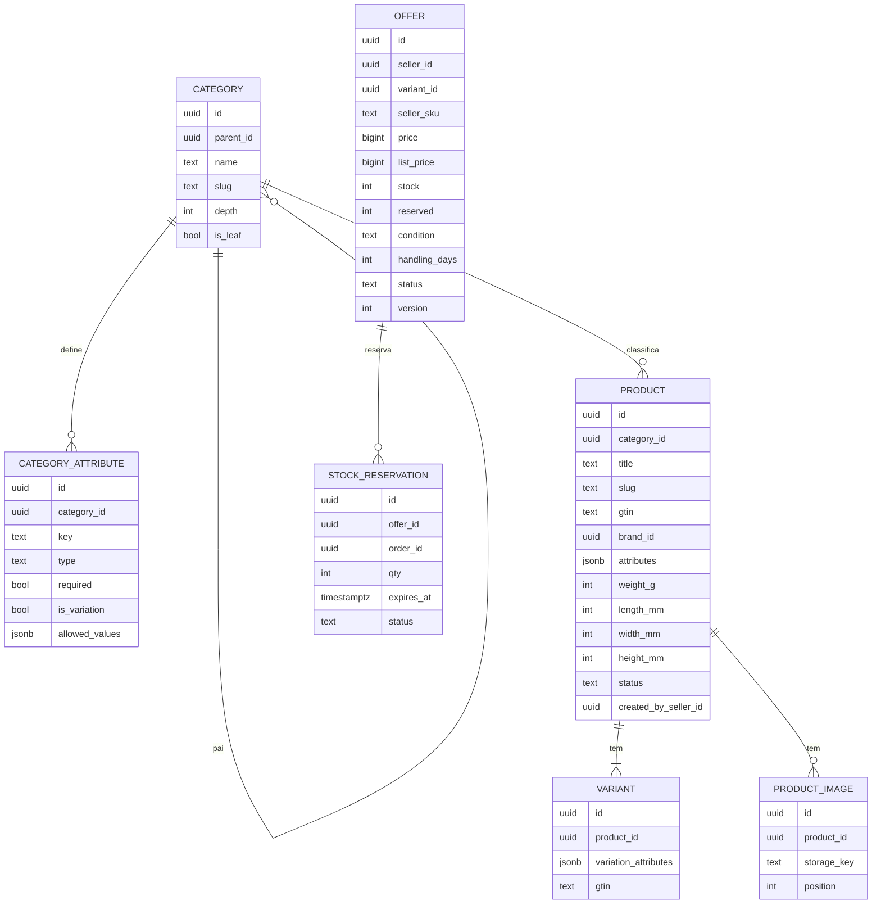
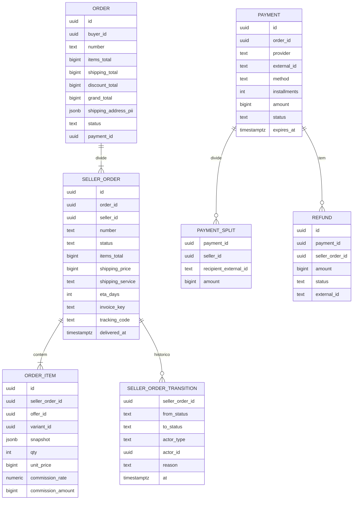
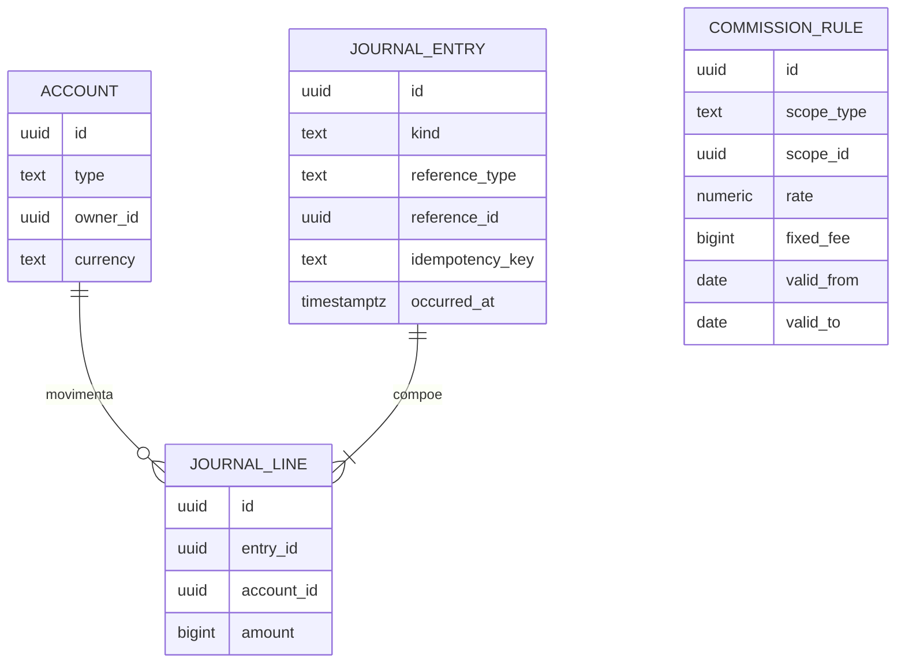

# Arquitetura — 04. Modelo de Dados (núcleo da Fase 1)

Cada bloco abaixo é um **schema Postgres diferente**. Referências entre schemas são apenas **IDs lógicos**
(sem foreign key física entre schemas — ADR-003). Dentro do mesmo schema, FKs normais.

**Multi-tenant (ADR-012):** toda tabela abaixo tem `tenant_id uuid NOT NULL` (omitido nos diagramas por legibilidade),
RLS habilitado e forçado, e todos os índices/unicidades começam por `tenant_id`. Exceção: schema `tenancy`.

Convenções de colunas: `id uuid pk (v7)`, `created_at`, `updated_at timestamptz`, `version int` (lock otimista
em agregados editáveis), dinheiro em `bigint` (centavos) + moeda implícita BRL, PII marcada com comentário
`-- pii` para as regras de redação/anonimização.

## tenancy (sem tenant_id)

Policy RLS padrão (gerada por `enableTenantRls`):
```sql
ALTER TABLE offers.offers ENABLE ROW LEVEL SECURITY;
ALTER TABLE offers.offers FORCE ROW LEVEL SECURITY;
CREATE POLICY tenant_isolation ON offers.offers
  USING (tenant_id = current_setting('app.tenant_id', true)::uuid)
  WITH CHECK (tenant_id = current_setting('app.tenant_id', true)::uuid);
```

## identity / sellers
Tabelas do lado Clerk (identity): `workforce_users(clerk_user_id pk, email, name, updated_at)` — **sem tenant_id**, são
globais como na Clerk, mas só acessadas via `org_links`; `org_links(clerk_org_id pk, kind, tenant_id, seller_id, created_at)`
com RLS por `tenant_id`; `org_memberships(clerk_org_id, clerk_user_id, role, tenant_id)` com RLS.
O diagrama abaixo (USER, ROLE_ASSIGNMENT...) refere-se aos **compradores** (identidade própria).
**Implementado (US-010):** `identity.customers` (`UNIQUE(tenant_id, email)`, documento como `document_type` +
`document_number` só dígitos, `password_hash` Argon2id em formato PHC), `identity.customer_consents` (histórico:
aceitar versão nova é linha nova; `ip inet`) e `identity.customer_email_verifications` (só o SHA-256 do token,
validade de 24 h). Todas com RLS forçado; eventos no `identity.outbox`. Papéis de comprador não têm tabela: o
storefront tem papel único (RF-IAM-07).


## catalog / offers

Restrições: `UNIQUE(tenant_id, seller_id, seller_sku)`, `UNIQUE(tenant_id, seller_id, variant_id, condition)`, `UNIQUE(tenant_id, slug)` em produto/categoria/seller,
`CHECK (stock >= 0 AND reserved >= 0 AND reserved <= stock)`. Reserva atômica:
`UPDATE offers SET reserved = reserved + $q WHERE id = $id AND stock - reserved >= $q`.

## orders / payments


## ledger

Invariantes: `SUM(amount) = 0` por `entry_id` (trigger `DEFERRABLE` ou verificação na aplicação + job de auditoria);
`UNIQUE(idempotency_key)`; tabela sem `UPDATE`/`DELETE` (revogar permissões do role da aplicação).
Saldo = `SUM(amount)` por conta, com tabela de snapshot diário para performance.

## platform (em todo schema que publica eventos)
```
outbox(id uuid pk, tenant_id uuid not null, type text, payload jsonb, occurred_at timestamptz, published_at timestamptz null, attempts int)
processed_events(tenant_id uuid, consumer text, event_id uuid, processed_at timestamptz, pk(consumer, event_id))
```
