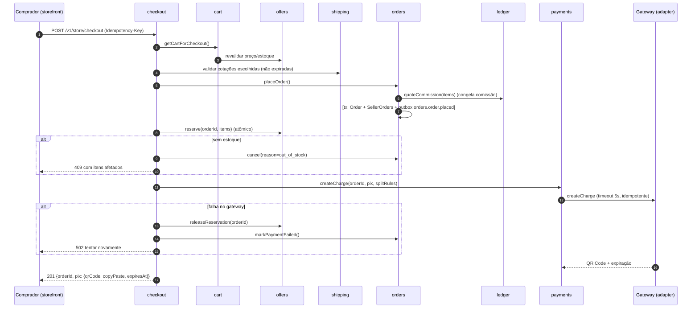
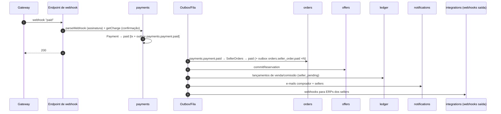
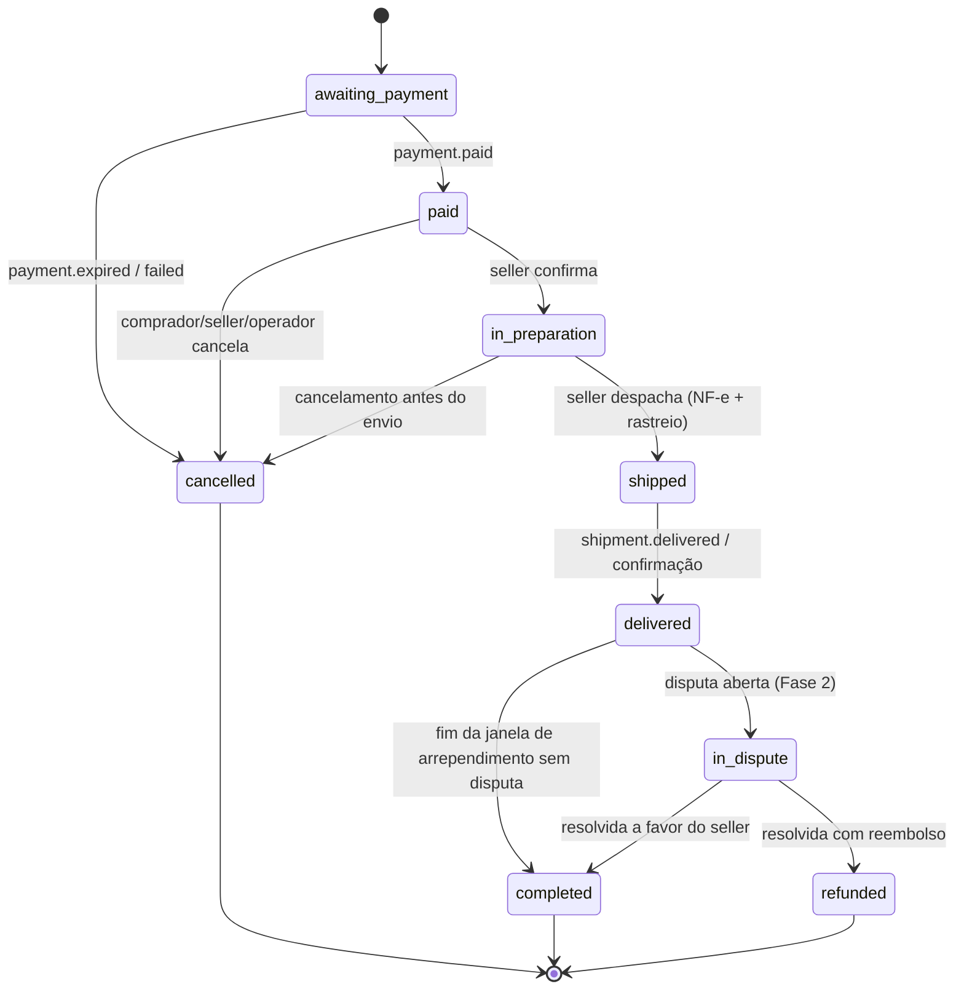
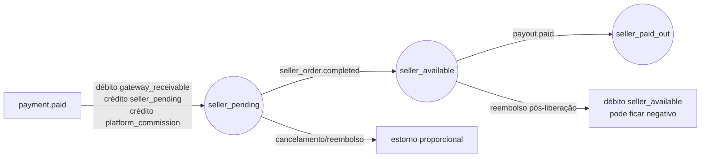

# Arquitetura — 05. Fluxos Críticos

## 1. Checkout multi-seller com Pix

Observação: `placeOrder` e `reserve` estão em schemas diferentes → não há transação única. A consistência é
garantida por **compensação** (release/cancel) e por um job de varredura que libera reservas órfãs expiradas.

## 2. Confirmação de pagamento e propagação

## 3. Ciclo de vida do SellerOrder

Todo `→ cancelled` após `paid` dispara reembolso (payments) e estorno de estoque (offers).

## 4. Fluxo financeiro de um SellerOrder

