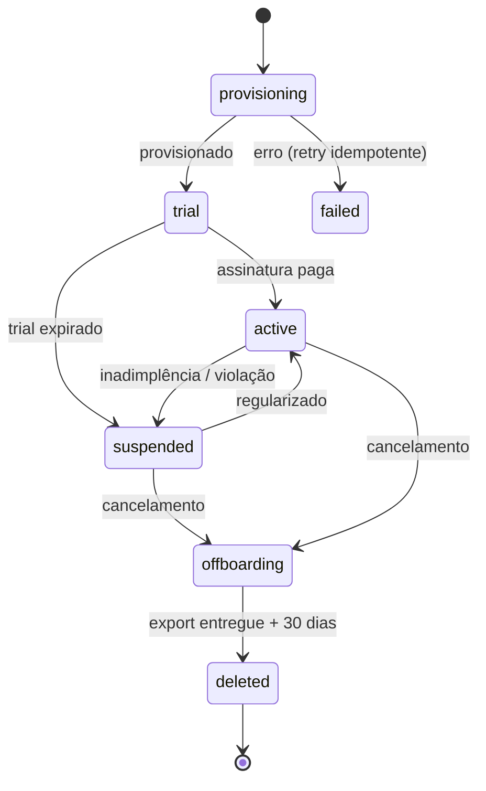

# Arquitetura — 06. Multi-tenancy

Decisão: **ADR-012** (pool + `tenant_id` + RLS, com saída para células). Este documento é a referência
de implementação. **Toda story deve respeitá-lo.**

## 1. Níveis hierárquicos e vocabulário

```
Plataforma SaaS (nós)                ← console, planos, cobrança dos tenants, suporte
 └── Tenant (operador de marketplace) ← admin do marketplace, configurações, integrações, domínio, tema
      ├── Sellers                     ← seller-center
      └── Compradores                 ← storefront do tenant
```

| Termo | Significado |
|---|---|
| **Plataforma** | A empresa dona do SaaS. Equipe = **staff da plataforma**. |
| **Tenant** | Cliente do SaaS que opera um marketplace. Tem `slug`, domínios, plano, status. |
| **Operador** | Usuário da equipe de um tenant (antes chamado apenas de "operador"). |
| **Célula** | Implantação completa (DB + processos). Padrão: todos os tenants na célula `shared-1`. |

## 2. Resolução do tenant (quem é o tenant desta requisição?)

| Canal | Origem do tenant | Observação |
|---|---|---|
| Storefront | `Host` → `tenancy.domains` (subdomínio `{slug}.<dominio-plataforma>`); domínio próprio chega via Cloudflare for SaaS com `X-Forwarded-Host`, aceito **somente** com `X-Edge-Secret` válido (ADR-014, US-085) | cache em memória + Redis, TTL 60 s |
| Seller center / Admin | **Organização ativa da Clerk** (claims `org_id`, `org_kind`, `tenant_id`, `seller_id`) conferida contra `identity.org_links` no banco | painéis em domínio único da plataforma (`admin.`/`vendedor.<plataforma>`); organização não mapeada ou tenant suspenso = 403 |
| API pública | API key (pertence a um seller de um tenant) ou token OAuth | host ignorado |
| Webhooks de entrada | `POST /v1/hooks/{category}/{provider}/{providerConfigId}` → config pertence a um tenant | validar assinatura com a credencial daquele tenant |
| Jobs / consumidores | `tenantid` do envelope do evento / payload do job | obrigatório; job sem tenant só se marcado `@PlatformJob` |
| Console da plataforma | Token da aplicação Clerk **Console**; sem tenant; ações em um tenant exigem **modo suporte** explícito (ver §7) | |

```mermaid
sequenceDiagram
  participant C as Cliente
  participant MW as TenantResolver (middleware)
  participant REG as tenancy (registro)
  participant UC as Caso de uso
  participant DB as PostgreSQL (RLS)
  C->>MW: GET https://loja-x.com.br/...
  MW->>REG: resolveByHost("loja-x.com.br") (cache)
  REG-->>MW: tenant {id, status, cell, plan}
  MW->>MW: status ativo? célula = esta? → AsyncLocalStorage.set(TenantContext)
  MW->>UC: executa
  UC->>DB: BEGIN; SET LOCAL app.tenant_id = '...'; SELECT ...; COMMIT
```
Tenant suspenso → storefront exibe página de indisponibilidade; APIs respondem 403 `tenant_suspended`.

## 3. Regras de dados

1. Toda tabela de negócio: `tenant_id uuid NOT NULL`, índice/PK composto começando por `tenant_id`,
   **todas** as constraints `UNIQUE` incluem `tenant_id` (ex.: `UNIQUE(tenant_id, slug)`).
2. Migração de cada tabela nova cria as policies RLS (helper `enableTenantRls(table)`); teste de CI falha se
   existir tabela com coluna `tenant_id` sem RLS habilitado e forçado (`FORCE ROW LEVEL SECURITY`).
3. Tabelas **sem** tenant ficam apenas no schema `tenancy` (tenants, domínios, planos, assinaturas), em
   `identity.workforce_users` (espelho dos usuários da Clerk, acessado só via `org_links`) e em
   tabelas de referência global explicitamente listadas (ex.: `ref.brazilian_states`, templates de categoria).
4. IDs são UUID v7 globais (nunca "id sequencial por tenant" exposto como chave). Números amigáveis de pedido
   são sequências por tenant (`tenant_counters`).
5. Consultas de plataforma (métricas de todos os tenants, faturamento SaaS) só em jobs `@PlatformJob` ou em
   projeções do módulo `tenancy`/`reporting`, com role privilegiado e auditoria.

## 4. Onde mais o tenant aparece

| Recurso | Regra |
|---|---|
| Eventos | `tenantid` obrigatório no envelope CloudEvents; o consumidor abre o contexto antes de processar |
| Filas / jobs | payload com `tenantId`; concorrência máxima por tenant configurável (fairness); rate limit por tenant |
| Cache (Redis) | chave `t:{tenantId}:...` |
| Object storage | prefixo `t/{tenantId}/...`; URLs pré-assinadas só para o prefixo do contexto |
| Busca | um índice por tenant (`products_{tenantId}`), com sinônimos e ranking próprios |
| Configuração `[config]` | hierarquia **padrão da plataforma → plano → tenant** (seller pode sobrepor onde permitido) |
| Integrações | credenciais e provedores ativos **por tenant** (cada tenant contrata seu gateway, frete, e-mail) |
| Webhooks de saída | endpoints por tenant/seller; nunca recebem evento de outro tenant |
| E-mails | remetente e templates por tenant (domínio do tenant verificado); fallback remetente da plataforma |
| Logs / métricas / traces | atributo `tenant.id` em tudo; dashboards filtráveis por tenant |
| Rate limit | por IP, por usuário, por API key **e** por tenant (cota do plano) |

## 5. Identidade

Duas identidades (ADR-013):

| Quem | Provedor | Pool de usuários | Onde loga | Marca na tela de login |
|---|---|---|---|---|
| Compradores | Módulo `identity` próprio | **Isolado por tenant** (`UNIQUE(tenant_id, email)`) | storefront no domínio do tenant | do tenant |
| Operadores e sellers | **Clerk** — aplicação "Plataforma" | Compartilhado; tenant e seller são **Organizations** | `admin.` / `vendedor.<plataforma>` | da plataforma (marca do tenant após login) |
| Staff | **Clerk** — aplicação "Console" | Separado, restrito | `console.<plataforma>` | da plataforma |

- Um seller que vende em dois marketplaces tem **uma** conta Clerk e **duas** organizações (uma por loja/tenant).
  Os dados de negócio do seller continuam isolados por tenant no nosso banco.
- Organização Clerk é só identidade/membros: nada de dado de negócio em `publicMetadata` além de `kind`, `tenantId`, `sellerId`.
- JWT de comprador contém `sub`, `tid`, papéis; refresh tokens e sessões por tenant.
- Login social de compradores (Fase 2): credenciais OAuth da plataforma ou do tenant (plano superior).

## 6. Pagamentos e dinheiro em multi-tenant

- Cada **tenant** é o marketplace perante o gateway: tem a **própria conta** no gateway (credenciais em `integrations`
  no escopo do tenant) e seus sellers são recebedores dessa conta. A comissão cai no recebedor do tenant.
- A **plataforma** cobra o tenant por **assinatura + taxa sobre GMV** (padrão D8), via módulo `saas-billing`,
  num fluxo de cobrança separado do dinheiro dos sellers. Opcional (se o gateway permitir): regra de split
  adicional para a plataforma em cada venda.
- O ledger é por tenant; o faturamento da plataforma usa projeção de GMV alimentada por eventos.

## 7. Acesso de suporte (staff → tenant)

- Staff (autenticado no Console/Clerk) entra em um tenant apenas via **modo suporte** — nosso mecanismo, não a impersonação da Clerk: escolhe tenant + motivo + duração (máx. 2 h), recebe
  token com `tid` do tenant e flag `support=true`, somente leitura por padrão; escrita exige papel específico.
- Tudo registrado no audit log **do tenant** e visível ao admin do tenant ("A plataforma acessou sua conta em...").

## 8. Planos e módulos (entitlements)

O "modular" do produto vira comercial: cada **plano** habilita módulos e limites.

```ts
// exemplo de entitlements de um plano
{ modules: ['catalog','orders','payments','shipping','reviews','disputes','promotions','public_api','erp_connectors'],
  limits: { sellers: 200, skus: 100000, apiRequestsPerMinute: 600, staffUsers: 10, customDomains: 2 } }
```
- Guard `@RequiresModule('disputes')` nas rotas; UI esconde menus de módulos não contratados.
- Módulo desligado **continua consumindo eventos** necessários à consistência (ex.: ledger), só não expõe funcionalidade.
- Limites checados em casos de uso (ex.: criar seller acima do limite → erro `plan_limit_reached`).

## 9. Ciclo de vida do tenant


**Provisionamento** (idempotente, orquestrado por eventos `tenancy.tenant.created` → cada módulo semeia seus dados):
registro do tenant e subdomínio → seeds (categorias do template escolhido, templates de e-mail, configurações padrão,
índice de busca, conta de ledger da plataforma do tenant) → convite do admin do tenant → `tenancy.tenant.provisioned`.

**Offboarding:** export completo em formato aberto (JSON/CSV + imagens) → aviso → purge físico de todas as linhas
do tenant (job por módulo que confirma via evento `tenancy.tenant.purged.<modulo>`), do índice e do storage.
Dados fiscais/financeiros entregues ao tenant, que é o responsável legal pela guarda.

## 10. Personalização (white-label)

- Tema por tenant: tokens de design (cores, fontes, raio), logo, favicon, textos legais, páginas institucionais (CMS).
- Domínio próprio com TLS automático via `DomainProvisioningPort` (Vercel Domains API, Cloudflare for SaaS ou
  Caddy on-demand TLS) + verificação por DNS.
- **Sem código customizado por tenant.** Customizações de comportamento vêm de configuração, planos, webhooks,
  API pública e (Fase 3) apps. Isso mantém uma única base de código.

## 11. Testes obrigatórios de isolamento

- **Suíte de isolamento** em `test/tenancy/`: para cada rota, cria dados em Tenant A e B e verifica que requisições
  autenticadas em A nunca leem/alteram B (inclusive por ID direto — IDOR entre tenants).
- Teste que executa consultas sem `SET LOCAL app.tenant_id` e espera **zero linhas** (prova que RLS está ativo).
- Teste de consumidor de evento com `tenantid` errado/ausente → rejeitado para DLQ.
- Teste de cache/storage/busca: chave e índice sempre prefixados.
