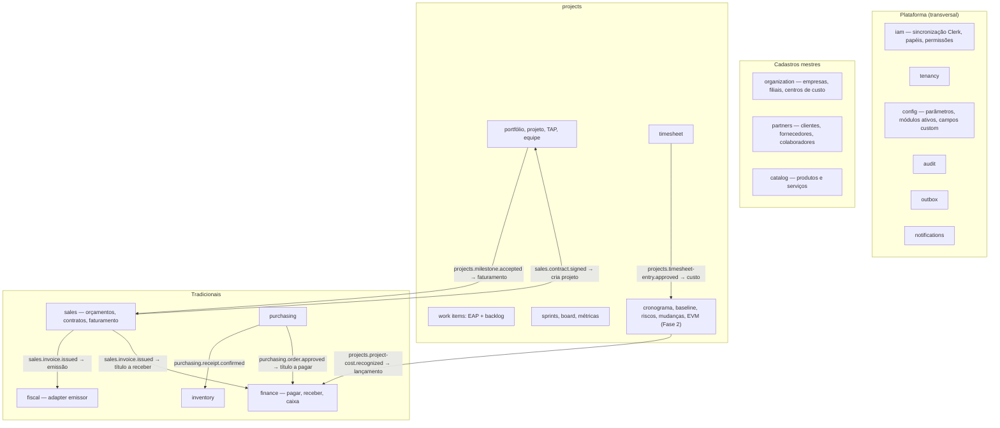

# 01 — Mapa de Módulos (bounded contexts)

## Diagrama

## Responsabilidades

| Módulo (código) | Nome | Responsabilidade | Fase |
|---|---|---|---|
| `platform/tenancy` | Tenancy | Tenants, contexto de tenant, transação com RLS | 0 |
| `platform/iam` | Identidade & Acesso | Verificação de token do Clerk, sincronização de usuários/organizações/memberships (webhook + JIT), papéis e permissões (ADR-004) | 0 |
| `platform/audit` | Auditoria | Registro e consulta de trilha de auditoria | 0 |
| `platform/outbox` | Outbox | Publicação confiável de eventos, base de consumidores idempotentes | 0 |
| `platform/config` | Configuração | Parâmetros por tenant, módulos ativos; campos customizados (Fase 2) | 0/2 |
| `platform/notifications` | Notificações | Notificações in-app e e-mail | 1 |
| `modules/organization` | Organização | Empresas (CNPJ), filiais, centros de custo | 1 |
| `modules/partners` | Parceiros | Pessoas físicas/jurídicas nos papéis cliente, fornecedor, colaborador; custo/hora de colaborador | 1 |
| `modules/catalog` | Catálogo | Produtos e serviços | 3 |
| `modules/projects` | Projetos | Ver `docs/dominio/projects.md` | 1/2 |
| `modules/finance` | Financeiro | Títulos a pagar/receber, baixas, contas, fluxo de caixa | 2 |
| `modules/sales` | Vendas | Orçamentos, contratos, regras e emissão de faturamento | 3 |
| `modules/fiscal` | Fiscal | Documentos fiscais via provedor externo (ADR-006) | 3 |
| `modules/purchasing` | Compras | Requisições, cotações, pedidos, recebimentos | 4 |
| `modules/inventory` | Estoque | Locais, saldos, movimentações, inventário | 4 |

## Regras de dependência

- Módulos de negócio dependem de `platform/*`, `shared/*` e das libs `-api` de outros módulos.
- `platform/*` não depende de módulos de negócio.
- Leitura de dados de outro módulo: fachada declarada no `-api` (ex.: `PartnersQueryFacade.getEmployeeCostRate(id, date)`).
- Efeitos colaterais em outro módulo: sempre evento via outbox.
