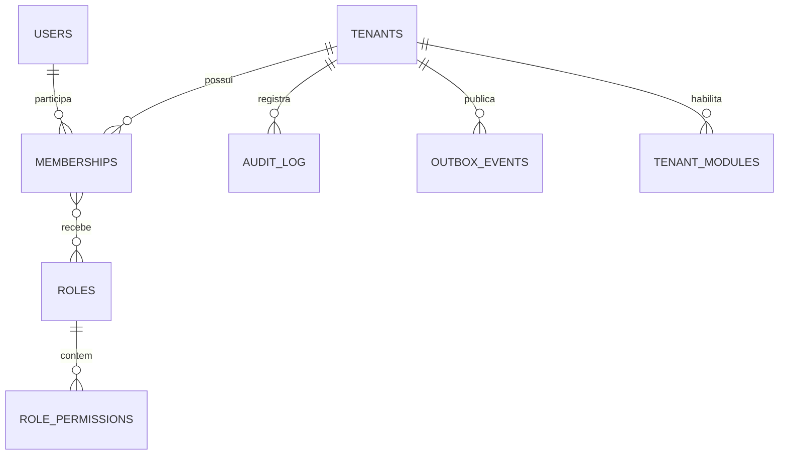

# Modelo de domínio — Plataforma

Schema Postgres: `platform`. Tabelas sem `tenant_id` estão marcadas como **(global)**; todas as demais
têm `tenant_id` + RLS. Colunas padrão omitidas nas tabelas abaixo, mas obrigatórias em tabelas de negócio:
`id uuid pk`, `tenant_id`, `created_at`, `created_by`, `updated_at`, `updated_by`, `version int`.

## Diagrama

## Tabelas

### tenants (global)
Espelho de uma Organization do Clerk (ADR-004).

| Coluna | Tipo | Regra |
|---|---|---|
| id | uuid | usado como `tenant_id` em todo o sistema |
| clerk_org_id | text | único; ex.: `org_2ab...` |
| name | text | sincronizado do Clerk |
| slug | text | sincronizado do Clerk |
| status | enum | `ACTIVE`, `SUSPENDED`, `CANCELLED` (controlado por nós, não pelo Clerk) |
| created_at | timestamptz | |

Tenant `SUSPENDED` ou `CANCELLED`: todas as rotas retornam 403 `TENANT_INACTIVE`.

### users (global)
Espelho de um User do Clerk. **Sem senha e sem dados de sessão.**

| Coluna | Tipo | Regra |
|---|---|---|
| id | uuid | usado em `created_by`, `assignee_user_id` etc. |
| clerk_user_id | text | único; ex.: `user_2ab...` |
| email | citext | e-mail primário; **PII** |
| name | text | **PII** |
| status | enum | `ACTIVE`, `DELETED` (usuário excluído no Clerk vira `DELETED`; nunca apagamos a linha, por causa da auditoria) |

### memberships
Espelho de uma OrganizationMembership do Clerk: `user_id`, `clerk_membership_id` (único),
`status` (`ACTIVE`, `REVOKED`). Único por (`tenant_id`, `user_id`).
Membership removido no Clerk vira `REVOKED` (não apagamos: histórico e auditoria).

### roles / role_permissions / membership_roles
- `roles`: `name` (único no tenant), `description`, `is_system` (papéis semeados não podem ser excluídos).
- `role_permissions`: (`role_id`, `permission` text).
- `membership_roles`: (`membership_id`, `role_id`).
- Papéis semeados em todo tenant novo: `Administrador`, `Gestor de Portfólio`, `Gerente de Projetos`,
  `Membro de Equipe`, `Financeiro`, `Leitor`.

### tenant_modules
(`tenant_id`, `module` text, `enabled` bool). Módulo desabilitado: rotas retornam 404 e menu some.

### tenant_settings
(`tenant_id`, `key`, `value jsonb`). Parâmetros por tenant, com schema zod por chave.

### audit_log
| Coluna | Tipo | Regra |
|---|---|---|
| tenant_id | uuid | RLS |
| occurred_at | timestamptz | |
| user_id | uuid null | null para ações de sistema |
| correlation_id | text | |
| module | text | ex.: `projects` |
| entity | text | ex.: `work_item` |
| entity_id | uuid | |
| action | enum | `CREATE`, `UPDATE`, `DELETE`, `ARCHIVE`, `RESTORE` |
| before | jsonb null | campos **PII** mascarados |
| after | jsonb null | idem |

Role `app_user` tem apenas INSERT e SELECT (RNF031). Índice (`tenant_id`, `entity`, `entity_id`, `occurred_at`).

### outbox_events / processed_events
Conforme ADR-003. Webhooks do Clerk também usam `processed_events`, com `consumer_name = 'clerk-webhook'`
e o `svix-id` como id do evento.
`processed_events` é global (sem RLS): `consumer_name text`, `event_id text`, `processed_at`; PK (`consumer_name`, `event_id`).
