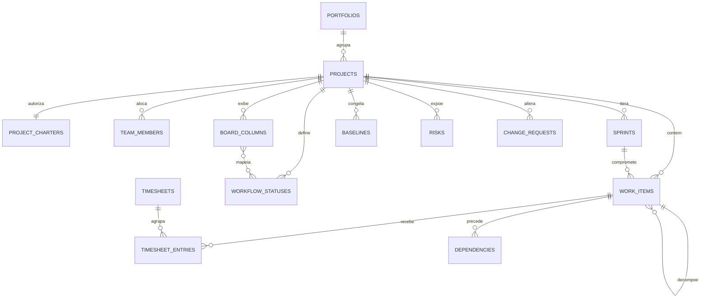
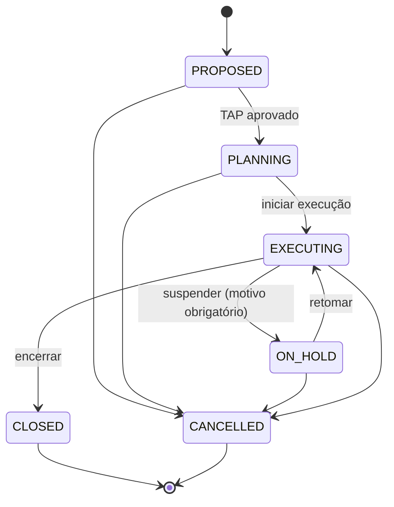

# Modelo de domínio — Projetos

Schema Postgres: `projects`. Decisão de base: ADR-007 (modelo híbrido unificado).
Tabelas marcadas **(F2)** são da Fase 2 e não devem ser criadas na Fase 1.

## Diagrama

## Projeto

### portfolios
`name`, `description`, `owner_user_id`. Um projeto pertence a no máximo um portfólio. (Tabela criada na Fase 1, telas de portfólio na Fase 2.)

### projects
| Coluna | Tipo | Regra |
|---|---|---|
| code | text | único no tenant; gerado `PRJ-0001` se não informado |
| name | text | obrigatório, 3–120 caracteres |
| customer_partner_id | uuid null | parceiro com papel `CUSTOMER` (validado via fachada) |
| company_id | uuid | empresa executora |
| cost_center_id | uuid null | |
| portfolio_id | uuid null | |
| delivery_approach | enum | `PREDICTIVE`, `AGILE`, `HYBRID` |
| project_manager_user_id | uuid | obrigatório |
| status | enum | ver ciclo de vida |
| planned_start / planned_end | date | fim ≥ início |
| actual_start / actual_end | date null | preenchidos nas transições |
| budget_at_completion | numeric(19,4) null | BAC |
| sprint_length_days | int null | obrigatório se AGILE/HYBRID; 7–28 |
| definition_of_done | jsonb | lista de critérios (texto) |
| definition_of_ready | jsonb | lista de critérios (texto) |

**Ciclo de vida:**

Regras: apontamento de horas só em `EXECUTING`. `CLOSED` e `CANCELLED` são somente leitura.
Encerrar exige nenhuma sprint ativa (Fase 2: e lições aprendidas registradas ou dispensa justificada).

### project_charters (TAP) — 1:1 com projeto
`objective`, `justification`, `high_level_scope`, `out_of_scope`, `assumptions`, `constraints`,
`success_criteria`, `high_level_risks`, `sponsor_name`, `approved_at`, `approved_by`.
Aprovar o TAP exige `objective`, `justification`, `high_level_scope` e `success_criteria` preenchidos;
após aprovado, fica somente leitura (alterações na Fase 2 via change request).

### team_members
| Coluna | Tipo | Regra |
|---|---|---|
| project_id | uuid | |
| user_id | uuid | usuário ativo no tenant |
| employee_id | uuid null | preenchido automaticamente se o usuário for colaborador |
| project_role | enum | `PROJECT_MANAGER`, `PRODUCT_OWNER`, `SCRUM_MASTER`, `TEAM_MEMBER`, `STAKEHOLDER` |
| allocation_percent | numeric(9,4) | 0 < x ≤ 100 |
| start_date / end_date | date | |

Único por (projeto, usuário, papel). Projetos AGILE/HYBRID em execução devem ter um `PRODUCT_OWNER`.
**Visibilidade:** um usuário só vê projetos em que é membro, salvo permissão `projects.project.read-all`.

## Work items (hierarquia unificada)

### work_items
| Coluna | Tipo | Regra |
|---|---|---|
| project_id | uuid | |
| key | text | `<code do projeto>-<seq>`, ex.: `PRJ-0001-42`, sequencial por projeto, imutável |
| type | enum | `PHASE`, `DELIVERABLE`, `WORK_PACKAGE`, `MILESTONE`, `EPIC`, `STORY`, `TASK`, `BUG` |
| parent_id | uuid null | regras de parentesco no ADR-007; sem ciclos; mesmo projeto |
| wbs_code | text | calculado (`1`, `1.2`, `1.2.3`) para itens preditivos, recalculado ao mover |
| title | text | 3–200 caracteres |
| description | text null | markdown |
| status_id | uuid | status do workflow do projeto |
| assignee_user_id | uuid null | deve ser membro da equipe |
| rank | text | ordenação lexicográfica (LexoRank ou fractional indexing) |
| story_points | numeric(9,4) null | só STORY/BUG/EPIC; escala Fibonacci 0,1,2,3,5,8,13,21 |
| estimated_hours | numeric(19,6) null | |
| sprint_id | uuid null | só STORY/TASK/BUG |
| planned_start / planned_end | date null | preditivo |
| percent_complete | numeric(9,4) | 0–100; preditivo |
| planned_cost | numeric(19,4) null | preditivo |
| acceptance_criteria | text null | |
| dor_checked | jsonb | itens da DoR marcados |
| completed_at | timestamptz null | preenchido ao entrar em categoria DONE, limpo ao sair |
| archived_at | timestamptz null | |

Arquivar um item arquiva a subárvore. Item com apontamento de horas não pode ser excluído, só arquivado.

### workflow_statuses
`project_id`, `name`, `category` (`TODO`, `IN_PROGRESS`, `DONE`), `position`.
Criados por padrão: `A fazer` (TODO), `Em andamento` (IN_PROGRESS), `Em revisão` (IN_PROGRESS), `Concluído` (DONE).
Deve existir ao menos um status por categoria. Não se exclui status em uso.

### board_columns
`project_id`, `name`, `position`, `wip_limit int null`, `wip_policy` (`WARN`, `BLOCK`), lista de `status_ids`.

### sprints
| Coluna | Tipo | Regra |
|---|---|---|
| project_id | uuid | |
| name | text | padrão `Sprint N` |
| goal | text null | obrigatório para iniciar |
| start_date / end_date | date | duração = `sprint_length_days` do projeto (editável) |
| status | enum | `PLANNED`, `ACTIVE`, `CLOSED` |
| capacity_hours | numeric(19,6) null | |
| committed_points | numeric(9,4) null | snapshot ao iniciar |
| completed_points | numeric(9,4) null | snapshot ao encerrar |

Uma sprint `ACTIVE` por projeto. Ao encerrar, itens não concluídos vão para o backlog ou para a próxima sprint `PLANNED` (escolha do usuário).

### sprint_scope_changes
Registro de itens adicionados/removidos após o início (para burndown fiel): `sprint_id`, `work_item_id`, `change` (`ADDED`, `REMOVED`), `points`, `occurred_at`.

### work_item_status_history
`work_item_id`, `from_status_id`, `to_status_id`, `changed_at`, `changed_by`. Base para burndown, cycle time e CFD.

## Timesheet

### timesheets
`employee_id`, `user_id`, `week_start` (segunda-feira), `status` (`OPEN`, `SUBMITTED`, `APPROVED`, `REJECTED`),
`submitted_at`, `decided_at`, `decided_by`, `rejection_reason`. Único por (usuário, semana).

### timesheet_entries
| Coluna | Tipo | Regra |
|---|---|---|
| timesheet_id | uuid | |
| project_id | uuid | projeto em `EXECUTING`; usuário membro da equipe |
| work_item_id | uuid null | opcional; se informado, do mesmo projeto e não arquivado |
| entry_date | date | dentro da semana da folha; não futura |
| hours | numeric(19,6) | > 0, múltiplo de 0,25; soma do dia por usuário ≤ 24 |
| note | text null | |
| status | enum | `DRAFT`, `SUBMITTED`, `APPROVED`, `REJECTED` |

Aprovação é **por projeto**: o GP de cada projeto aprova/rejeita as entradas do seu projeto na folha.
A folha fica `APPROVED` quando todas as entradas estão aprovadas. Entradas aprovadas são imutáveis.
Evento `projects.timesheet-entry.approved.v1` (payload: `entryId`, `projectId`, `workItemId`, `employeeId`, `entryDate`, `hours`).

## Fase 2 (não implementar na Fase 1)

- **dependencies (F2):** `predecessor_id`, `successor_id`, `type` (`FS`, `SS`, `FF`, `SF`), `lag_days`; sem ciclos.
- **baselines (F2):** snapshot versionado de datas, custos e escopo (pontos) do projeto.
- **risks (F2):** descrição, categoria, probabilidade (1–5), impacto (1–5), severidade calculada, estratégia (`AVOID`, `MITIGATE`, `TRANSFER`, `ACCEPT`, `EXPLOIT`, `ENHANCE`, `SHARE`), responsável, plano de resposta, status.
- **issues (F2):** impedimentos e questões, com responsável e prazo.
- **change_requests (F2):** descrição, impacto em escopo/prazo/custo, status (`OPEN`, `APPROVED`, `REJECTED`); aprovação gera nova baseline.
- **stakeholders (F2):** registro de partes interessadas, poder × interesse, estratégia de engajamento.
- **retrospectives (F2):** itens (o que foi bem, melhorar, ações) por sprint.
- **lessons_learned (F2):** categoria, descrição, recomendação; pesquisáveis entre projetos.
- **project_costs (F2):** custo reconhecido a partir de horas aprovadas × custo/hora vigente + despesas.

## Métricas (definições canônicas)

| Métrica | Definição |
|---|---|
| Velocidade | soma de `story_points` de itens que entraram em DONE durante a sprint e pertenciam a ela no encerramento; média móvel das últimas 3 sprints fechadas |
| Burndown da sprint | por dia: pontos comprometidos + adicionados − removidos − concluídos até o dia; linha ideal linear do comprometido até zero |
| % concluído (preditivo) | média de `percent_complete` dos work packages ponderada por `planned_cost` (ou por `estimated_hours` se não houver custo) |
| % concluído (ágil) | pontos em DONE / pontos totais do escopo não arquivado |
| Cycle time | tempo entre a primeira entrada em IN_PROGRESS e a entrada em DONE |
